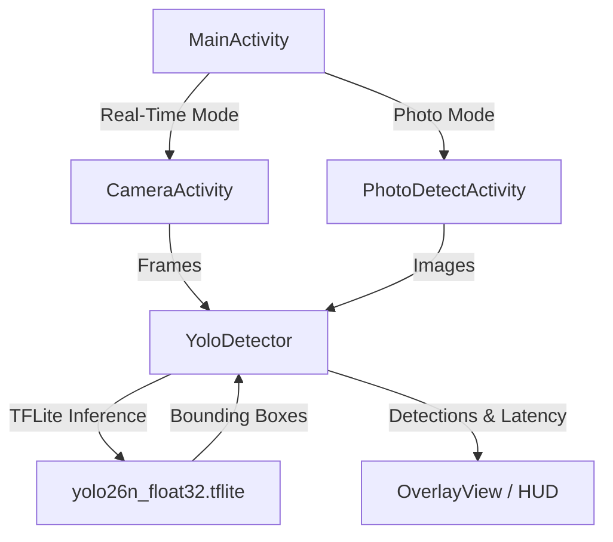

# YoloDetector 🛸
[](https://kotlinlang.org/)
[](https://www.tensorflow.org/lite)
[](https://developer.android.com/jetpack/androidx/releases/camera)
[](LICENSE)

An advanced, high-performance Android application featuring real-time object detection using a customized **YOLO26n** (float32) model powered by **TensorFlow Lite**. Implemented with a sleek **Sci-Fi HUD overlay** and a clean **Neumorphic design system**, YoloDetector delivers desktop-grade edge computing on mobile devices.

---


---

## 🌟 Key Features

*   **Real-Time Camera Detection**: Powered by **Android Jetpack CameraX**, capturing live frames and conducting inference with negligible latency.
*   **Static Photo Analyzer**: Feed images from your gallery or take a new picture using the system camera, and instantly see overlay boxes and confidence scores.
*   **Sci-Fi HUD Interface**: The camera view utilizes a specialized HUD aesthetic complete with edge glow, custom wireframes, and live diagnostic readouts.
*   **GPU Acceleration**: Automated hardware delegate configuration. The app scans device compatibility and selects the **TFLite GPU Delegate** for rapid inference, falling back to CPU multi-threading (4 threads) if unavailable.
*   **Advanced Camera Controls**: Fully integrated pinch-to-zoom gestures, a manual zoom slider, precise increment/decrement buttons, and a front/back camera toggle.
*   **COCO dataset ready**: Supports the detection of 80 standard classes, from people and vehicles to household electronics.
*   **Neumorphic Dashboard**: Modern, soft-shadow neumorphic UI cards on the landing screen, incorporating interactive states for a highly responsive, premium feel.

---

## 📸 Screenshots

| Dashboard (Neumorphic) | Live Detection (Sci-Fi HUD) | Photo Analyzer |
|:---:|:---:|:---:|
|  |  |  |

*(Place screenshots in `assets/` to display them here)*

---

## 🛠️ Architecture & Flow

The project is structured under a clean modular architecture:



### Technical Highlights:
*   **Model Input**: Bounded RGB float32 normalized image of size $640 \times 640 \times 3$.
*   **Non-Maximum Suppression (NMS)**: Handled directly within the TFLite graph (end-to-end export) yielding a `[1, 300, 6]` tensor output `[x1, y1, x2, y2, confidence, class_id]`.
*   **Coordinate Scaling**: Dynamic viewport transformations scale normalized coordinates to fit screen boundaries regardless of device aspect ratio.

---

## 🚀 Getting Started

### Prerequisites
*   Android Studio Jellyfish (or newer)
*   Gradle JDK 17+
*   Physical Android device running API 24 (Nougat) or higher (strongly recommended for CameraX and GPU delegate functionality)

### Installation
1.  **Clone the Repository**:
    ```bash
    git clone https://github.com/shivamprasad1001/YoloDetector.git
    cd YoloDetector
    ```
2.  **Open in Android Studio**:
    *   File -> Open -> Select the cloned `YoloDetector` root folder.
3.  **Sync Gradle**:
    *   Wait for Gradle Sync to complete and download TFLite/CameraX dependencies.
4.  **Run the Project**:
    *   Connect your Android device via USB/Wi-Fi debugging and press `Run`.

---

## 📦 Dependencies & Stack

This app leverages state-of-the-art Jetpack libraries and ML engines:

*   **TensorFlow Lite** (`org.tensorflow:tensorflow-lite:2.14.0`): Efficient machine learning runtime on mobile devices.
*   **TFLite GPU Delegate** (`org.tensorflow:tensorflow-lite-gpu:2.14.0`): Empowers high-speed GPU pipeline processing.
*   **CameraX API** (`androidx.camera`): Flexible camera API that handles resolution matching, rotation, and lifecycle state management automatically.
*   **ViewBinding**: Simplifies layout binding and eradicates boilerplate code.

---

## 💻 Developer & Portfolio

Developed and maintained by **Shivam Prasad**. 

*   🌐 **Website & Portfolio**: [shivamprasad1001.in](https://shivamprasad1001.in)
*   🐙 **GitHub**: [@shivamprasad1001](https://github.com/shivamprasad1001)

---

## 📄 License

This project is licensed under the MIT License - see the [LICENSE](LICENSE) file for details.
